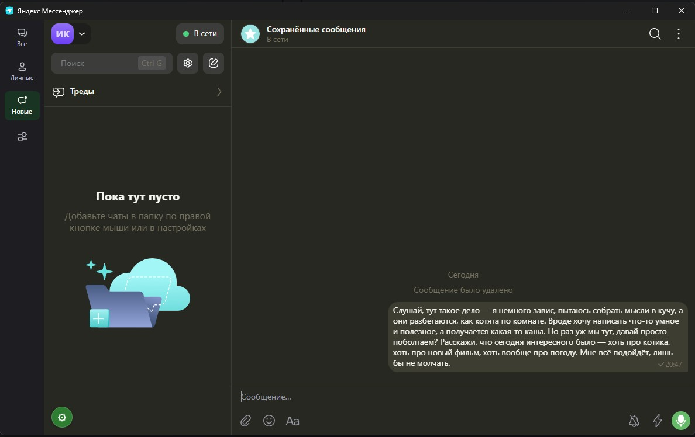
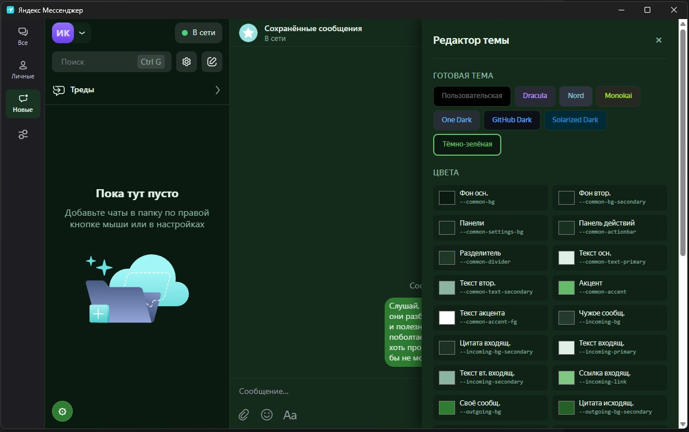

# Патчер тем для Яндекс Мессенджера

Кастомный движок тем для десктопного приложения Яндекс Мессенджер (Electron).

## Возможности

- **Редактор цветов** — меняйте любой цвет интерфейса в реальном времени через встроенную панель
- **Готовые темы** — Dracula, Nord, Monokai, One Dark, GitHub Dark, Solarized Dark, Dark Green
- **Фон чата** — установите любое изображение в качестве фона области чата
- **Сохранение настроек** — все изменения сохраняются автоматически

## Скриншоты





## Установка

### Требования

- [Node.js](https://nodejs.org/) (для `npx asar` — нужен только при установке)
- Яндекс Мессенджер (десктопная версия)

### Linux / macOS

1. Скачайте и распакуйте архив
2. **Полностью закройте Яндекс Мессенджер**
3. Сделайте скрипт исполняемым и запустите:

```bash
chmod +x install.sh
./install.sh
```

Если скрипт не находит Мессенджер автоматически, укажите путь вручную:

```bash
./install.sh /opt/yandex-messenger
```

4. Запустите Яндекс Мессенджер
5. Нажмите на значок ⚙ в левом нижнем углу списка чатов, чтобы открыть редактор тем

### Windows

1. Скачайте и распакуйте архив
2. **Полностью закройте Яндекс Мессенджер** (проверьте системный трей)
3. Запустите от имени администратора:

```powershell
Set-ExecutionPolicy -Scope Process -ExecutionPolicy Bypass
.\install.ps1
```

Если скрипт не находит Мессенджер автоматически, укажите путь вручную:

```powershell
.\install.ps1 -AppPath "C:\Users\%USERNAME%\AppData\Local\Programs\chats"
```

4. Запустите Яндекс Мессенджер
5. Нажмите на значок ⚙ в левом нижнем углу списка чатов, чтобы открыть редактор тем

### Ручная установка

Если скрипт не сработал, выполните шаги вручную:

1. Закройте Яндекс Мессенджер
2. Сделайте резервную копию `resources/app.asar` (скопируйте в `app.asar.backup`)
3. Распакуйте asar: `npx asar extract resources/app.asar resources/app.asar.extracted`
4. Скопируйте `patch/static/www/green-theme.css` и `patch/static/www/theme-editor.js` в `resources/app.asar.extracted/static/www/`
5. Отредактируйте `resources/app.asar.extracted/static/www/index.html`:

   **Было:** `href="app.css" rel="stylesheet"></head>`
   
   **Стало:** `href="app.css" rel="stylesheet"><link href="green-theme.css" rel="stylesheet"><script defer="defer" src="theme-editor.js"></script></head>`

6. Запакуйте обратно: `npx asar pack resources/app.asar.extracted resources/app.asar`
7. Запустите Яндекс Мессенджер

### Удаление

Восстановите оригинальный `app.asar` из резервной копии:

```powershell
Copy-Item "$env:LOCALAPPDATA\Programs\chats\resources\app.asar.backup" "$env:LOCALAPPDATA\Programs\chats\resources\app.asar" -Force
```

Или переустановите Яндекс Мессенджер.

## Использование

1. Нажмите на значок ⚙ (левый нижний угол списка чатов)
2. Выберите готовую тему или настройте отдельные цвета
3. Загрузите фоновое изображение для области чата
4. Изменения сохраняются автоматически

## Файлы

| Файл | Назначение |
|------|------------|
| `patch/static/www/green-theme.css` | Базовая тёмно-зелёная тема с переопределениями через `!important` |
| `patch/static/www/theme-editor.js` | Встроенная панель редактора тем с MutationObserver |
| `install.ps1` | Скрипт установки для Windows |
| `install.sh` | Скрипт установки для Linux / macOS |
| `README.md` | Этот файл |

## Лицензия

MIT
